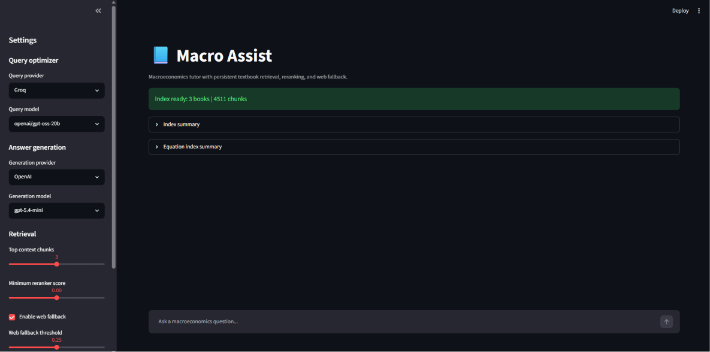
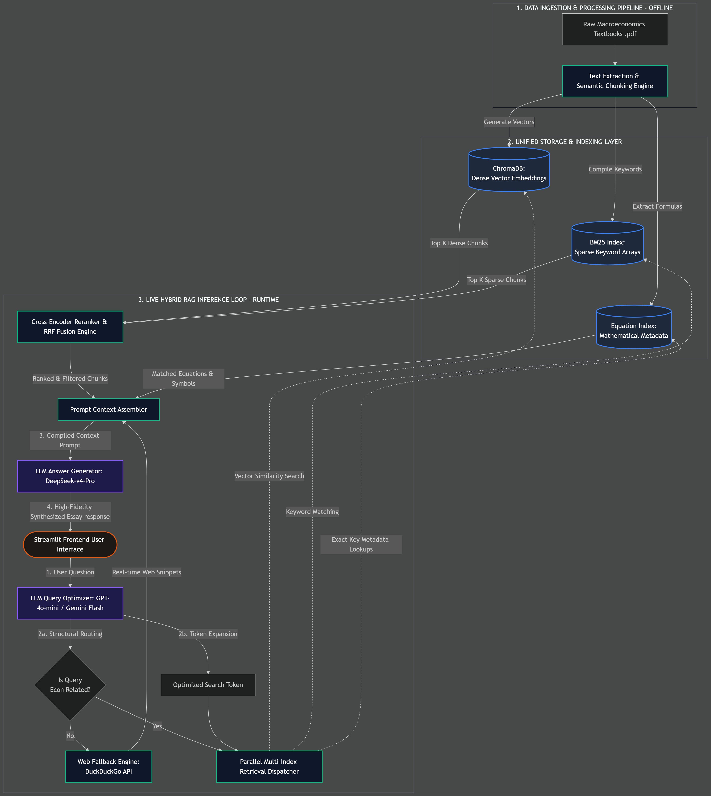
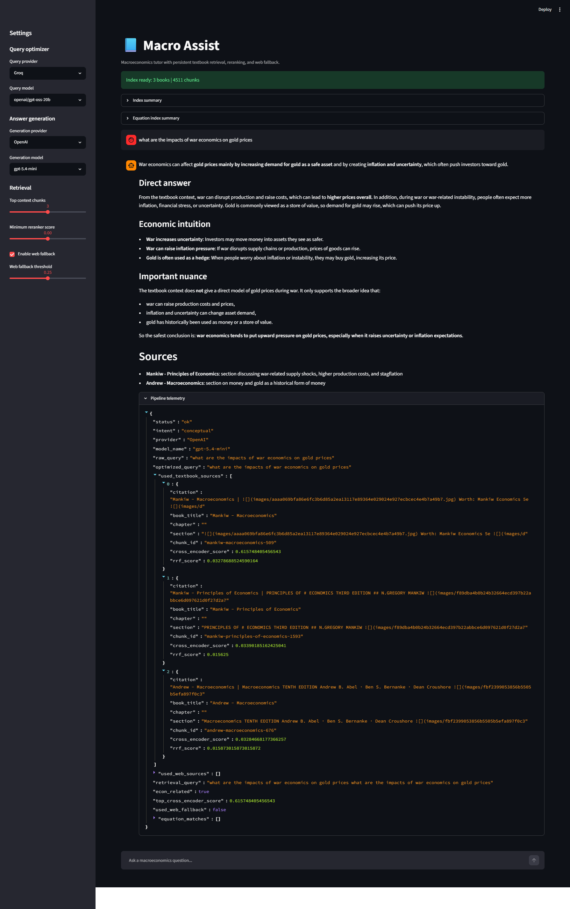
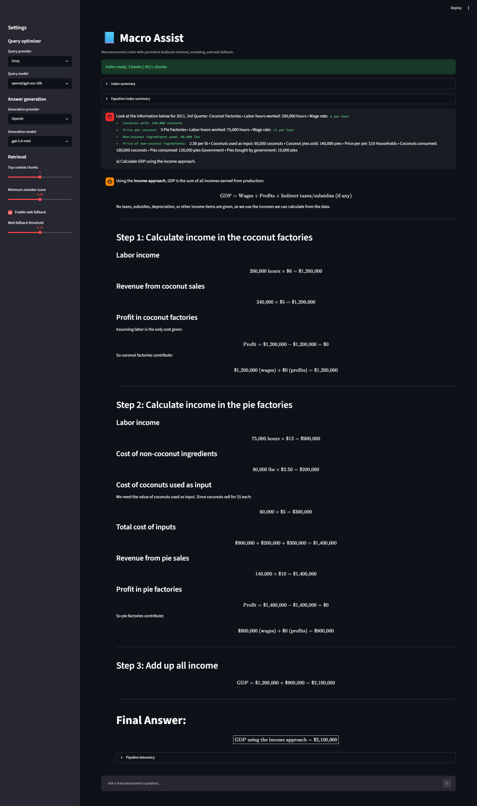
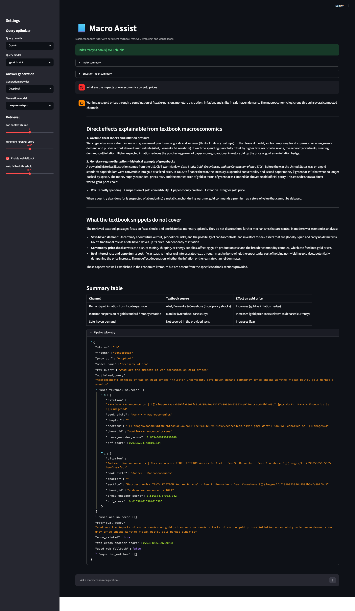

# 📘 Macro Assist

> An AI-powered Macroeconomics Tutor that combines hybrid retrieval, equation-aware search, and automated numerical solving to deliver textbook-grounded answers.

[](https://github.com/mbh2006/macro_assist)
[](https://www.python.org/)
[](https://streamlit.io/)



---

## 🔍 Overview

Macro Assist is an AI-powered Macroeconomics Tutor that combines Retrieval-Augmented Generation (RAG), hybrid search, equation retrieval, and automated numerical problem solving to provide accurate, textbook-grounded answers.

The system retrieves information from multiple macroeconomics textbooks using dense vector retrieval, sparse keyword retrieval, cross-encoder reranking, and equation-aware search. When textbook evidence is insufficient, Macro Assist can utilize trusted economics sources as a controlled fallback.

This project was developed to help students quickly locate relevant macroeconomic concepts, formulas, and worked examples across multiple textbooks while maintaining source-grounded responses.

---

## ⚡ Key Features

* **📚 Multi-textbook knowledge base:** Synthesizes answers seamlessly across multiple parsed textbooks.
* **🔍 Hybrid retrieval:** Parallel search utilizing ChromaDB (dense) and BM25 (sparse).
* **🎯 Cross-encoder reranking:** Uses `BAAI/bge-reranker-base` for precision context validation.
* **📐 Equation extraction and retrieval:** Dedicated metadata indexing for extracting economic formulas.
* **🧮 Automated numerical solving:** Parses inputs and leverages SymPy to solve textbook mathematical problems.
* **🧠 Semantic chunking:** Structured text fragmentation with Sentence Transformers.
* **📄 MinerU-based PDF parsing:** High-fidelity document text and equation extraction.
* **🌐 Controlled web fallback:** Domain-specific external search triggered when textbook context is low.
* **🤖 Multi-provider LLM support:** Gemini, OpenAI, Groq (openai/gpt-oss-120b), and DeepSeek.
* **💻 Interactive Streamlit interface.**

---

## 🏗️ System Architecture

The backend pipeline is strictly separated into an offline data ingestion engine and a low-latency, real-time hybrid inference loop.



### Retrieval Pipeline Flow
The retrieval workflow consists of:
1. **Query Optimization:** Cleans and expands the raw user inquiry.
2. **Parallel Search:** BM25 Sparse Retrieval + ChromaDB Dense Retrieval.
3. **Fusion:** Reciprocal Rank Fusion (RRF) to merge candidate lists.
4. **Validation:** Cross-Encoder Reranking to score exact relevance.
5. **Context Expansion:** Equation Retrieval and neighbor-chunk inclusion.
6. **Execution:** Numerical Solving (SymPy) if math is detected.
7. **Synthesis:** LLM Response Generation.

This design dramatically improves retrieval quality compared to standard vector-only RAG systems.

---

## 📸 Interface Showcases

### Conceptual Knowledge Lookup
Textbook-grounded explanations with deep structural clarity.


### Numerical Computation Analysis
Evaluates problem setups and outputs mathematical processes automatically.


<details>
<summary><b>🔬 Click to expand: Advanced Telemetry & Pipeline Diagnostics</b></summary>

Review detailed token matching, similarity scores, and execution telemetry behind the generation engine.

</details>

---

## 🚀 Installation & Setup

### 1. Clone Repository
```bash
git clone [https://github.com/mbh2006/macro_assist.git](https://github.com/mbh2006/macro_assist.git)
cd macro_assist
```

### 2. Create Virtual Environment
**Windows:**
```bash
python -m venv venv
venv\Scripts\activate
```

**Linux / macOS:**
```bash
python -m venv venv
source venv/bin/activate
```

### 3. Install Dependencies
```bash
pip install -r requirements.txt
```

### 4. Configure Environment Variables
Create a `.env` file in the project root:
```env
GEMINI_API_KEY=your_key
OPENAI_API_KEY=your_key
GROQ_API_KEY=your_key
DEEPSEEK_API_KEY=your_key
```

---

## ⚙️ Building the Knowledge Base

Place macroeconomics textbooks inside:
```text
data/macro_textbooks/
```

Run the ingestion pipeline:
```bash
python ingest/macro_ingest.py
```

This will generate the local retrieval assets:
```text
data/index/
├── macro_chroma_db/
├── macro_bm25.pkl
├── macro_equation_index.json
└── macro_index_manifest.json
```

---

## 💻 Running the Application

```bash
streamlit run app/macro_assist.py
```

---

## 🛡️ Reliability Features

Macro Assist includes several safeguards for real-world use:
* **Graceful Exception Routing:** Try/except fallbacks output system and numerical solver errors clearly inside the UI without crashing the application.
* **Empty-Response Detection:** Monitors LLM outputs to prevent blank returns.
* **Provider Safety Locks:** Auto-validates API connectivity and shifts execution cleanly if a model hits rate limits.
* **Controlled Refusal:** Explicitly informs the user if textbook evidence is completely insufficient.

---

## 🗺️ Limitations & Future Improvements

**Current Limitations:**
* Requires locally available textbook PDFs (not included in repo).
* Evaluation framework is not yet implemented.
* Numerical solving currently focuses on common macroeconomics formulas.
* Performance depends heavily on the quality of retrieved textbook content.

**Future Improvements:**
- [ ] Retrieval evaluation (Recall@K, MRR, NDCG).
- [ ] Faithfulness and answer correctness benchmarking.
- [ ] Citation-level source attribution.
- [ ] Adaptive retrieval strategies and automatic provider failover.
- [ ] Multi-modal document retrieval (graphs and charts).
- [ ] Voice-based tutoring.

---

## 📁 Repository Structure

```text
macro_assist/
│
├── app/
│   └── macro_assist.py
├── ingest/
│   └── macro_ingest.py
├── back_up/
├── data/
│   └── README.md
├── docs/
│   ├── architecture.png
│   └── screenshots/
│       ├── main_interface.png
│       ├── macro_assist_overview.png
│       ├── numerical_solution.png
│       └── rag_telemetry_deepseek_analysis.png
├── requirements.txt
├── .env.example
├── .gitignore
└── README.md
```

---

## 📄 License & Copyright Notes

This repository contains only source code and supporting documentation.

**Textbook PDFs, generated vector databases, BM25 indexes, and other derived content are excluded** due to copyright restrictions and must be supplied separately by users before building the knowledge base.

This project is provided for educational and academic research purposes.
Do not copy without permission!
